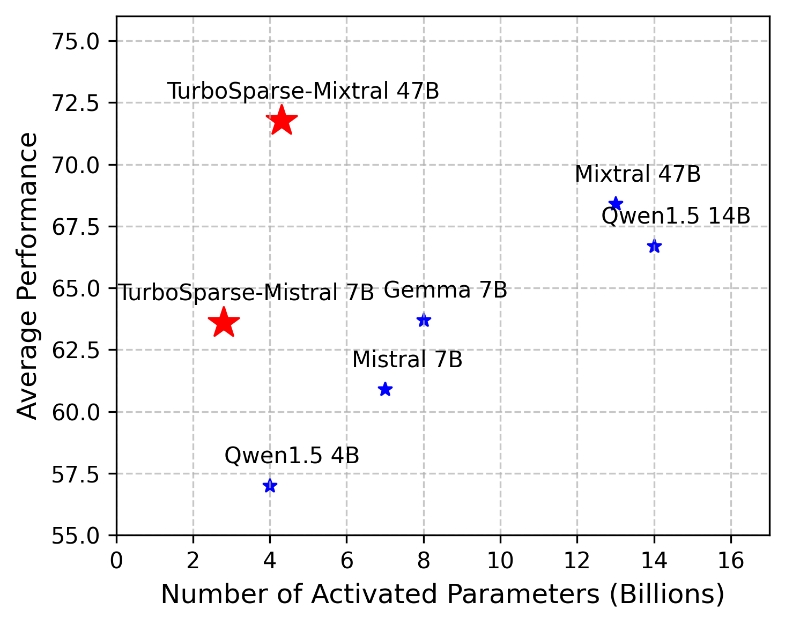

# Model Card for TurboSparse-Mistral
The TurboSparse-Mixtral Large Language Model (LLM) is an sparsified version of the Mixtral.



The average performance is evaluated using benchmarks from the OpenLLM Leaderboard.

## Inference

Our code for accelerating TurboSparse-Mixtral is currently being refined. Stay tuned! Now you can run this model like dense model.

## Chat-Template

During sparsification, we also utilize some SFT datasets.
We take ChatML as our chat template:
```
<|im_start|>user\n{{content}}<|im_end|>\n<|im_start|>assistant\n
```

## Allow Finetuning

As we merged the predictors for FFN neurons in models, you can finetune TurboSparse-Mistral with any framework and algorithm.

## License

The model is licensed under Apache-2.0, while model weights are fully open for academic research and also allow **free** commercial usage. 